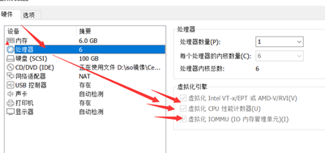
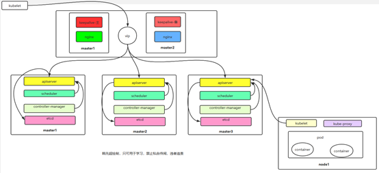

# **二进制安装多master节点的k8s集群-1.20以上稳定版本**

 

## **网络规划**

Pod网段：   10.0.0.0/16

Service网段：  10.255.0.0/16

| K8S集群角色 | Ip             | 主机名     | 安装的组件                                                   |
| :---------- | -------------- | ---------- | ------------------------------------------------------------ |
| 控制节点    | 192.168.40.180 | vicmaster1 | apiserver、controller-manager、scheduler、etcd、docker、keepalived、nginx |
| 控制节点    | 192.168.40.181 | vicmaster2 | apiserver、controller-manager、scheduler、etcd、docker、keepalived、nginx |
| 控制节点    | 192.168.40.182 | vicmaster3 | apiserver、controller-manager、scheduler、etcd、docker       |
| 工作节点    | 192.168.40.183 | vicnode1   | kubelet、kube-proxy、docker、calico、coredns                 |
| Vip         | 192.168.40.199 |            |                                                              |


 基础环境相关：

操作系统：centos7.6

配置： 4Gib内存/6vCPU/100G硬盘

注意：也可以用4vCPU

网络：NAT

开启虚拟机的虚拟化：

   


kubeadm和二进制安装k8s适用场景分析

kubeadm是官方提供的开源工具，是一个开源项目，用于快速搭建kubernetes集群，目前是比较方便和推荐使用的。kubeadm init 以及 kubeadm join 这两个命令可以快速创建 kubernetes 集群。Kubeadm初始化k8s，所有的组件都是以pod形式运行的，具备故障自恢复能力。

kubeadm是工具，可以快速搭建集群，也就是相当于用程序脚本帮我们装好了集群，属于自动部署，简化部署操作，自动部署屏蔽了很多细节，使得对各个模块感知很少，如果对k8s架构组件理解不深的话，遇到问题比较难排查。

**kubeadm适合需要经常部署k8s，或者对自动化要求比较高的场景下使用。**

 

二进制：在官网下载相关组件的二进制包，如果手动安装，对kubernetes理解也会更全面。 

Kubeadm和二进制都适合生产环境，在生产环境运行都很稳定，具体如何选择，可以根据实际项目进行评估。

 

回顾下k8s多master节点架构：

 

## 1.初始化

### 1.1 配置静态IP

把虚拟机或者物理机配置成静态ip地址，这样机器重新启动后ip地址也不会发生改变。

以vicmaster1主机修改静态IP为例:

```shell
#修改/etc/sysconfig/network-scripts/ifcfg-ens33文件，变成如下：

TYPE=Ethernet
PROXY_METHOD=none
BROWSER_ONLY=no
BOOTPROTO=static
IPADDR=192.168.40.180
NETMASK=255.255.255.0
GATEWAY=192.168.40.2
DNS1=192.168.40.2
DEFROUTE=yes
IPV4_FAILURE_FATAL=no
IPV6INIT=yes
IPV6_AUTOCONF=yes
IPV6_DEFROUTE=yes
IPV6_FAILURE_FATAL=no
IPV6_ADDR_GEN_MODE=stable-privacy
NAME=ens33
DEVICE=ens33
ONBOOT=yes

#修改配置文件之后需要重启网络服务才能使配置生效，重启网络服务命令如下：
# service network restart

注：/etc/sysconfig/network-scripts/ifcfg-ens33文件里的配置说明：

NAME=ens33  #网卡名字，跟DEVICE名字保持一致即可
DEVICE=ens33  #网卡设备名，大家ip addr可看到自己的这个网卡设备名，每个人的机器可能这个名字不一样，需要写自己的
BOOTPROTO=static  #static表示静态ip地址
ONBOOT=yes  #开机自启动网络，必须是yes
IPADDR=192.168.40.180  #ip地址，需要跟自己电脑所在网段一致
NETMASK=255.255.255.0 #子网掩码，需要跟自己电脑所在网段一致
GATEWAY=192.168.40.2  #网关，在自己电脑打开cmd，输入ipconfig /all可看到
DNS1=192.168.40.2   #DNS，在自己电脑打开cmd，输入ipconfig /all可看到 
```


### 1.2 配置主机名

```SHELL
#配置主机名：

在192.168.40.180上执行如下：
hostnamectl set-hostname vicmaster1

在192.168.40.181上执行如下：
hostnamectl set-hostname vicmaster2

在192.168.40.182上执行如下：
hostnamectl set-hostname vicmaster3

在192.168.40.183上执行如下：
hostnamectl set-hostname vicnode1
```


### 1.3 配置hosts文件

```shell
#修改vicmaster1、vicmaster2、vicmaster3、vicnode1机器的/etc/hosts文件，增加如下四行：

192.168.40.180  vicmaster1
192.168.40.181  vicmaster2
192.168.40.182  vicmaster3
192.168.40.183  vicnode1
```


### 1.4 配置主机之间无密码登录

每台机器都按照如下操作

```
#生成ssh 密钥对
# ssh-keygen -t rsa   #一路回车，不输入密码

#把本地的ssh公钥文件安装到远程主机对应的账户
ssh-copy-id -i .ssh/id_rsa.pub vicmaster1
ssh-copy-id -i .ssh/id_rsa.pub vicmaster2
ssh-copy-id -i .ssh/id_rsa.pub vicmaster3
ssh-copy-id -i .ssh/id_rsa.pub vicnode1
```


### 1.5 关闭firewalld防火墙

在vicmaster1、vicmaster2、vicmaster3、vicnode1上操作：

```
systemctl stop firewalld
systemctl disable firewalld
```


### 1.6 关闭selinux

在vicmaster1、vicmaster2、vicmaster3、vicnode1上操作：

```
sed -i 's/SELINUX=enforcing/SELINUX=disabled/g' /etc/selinux/config
setenforce 0   临时关闭selinux模式 
#修改selinux配置文件之后，重启机器，selinux配置才能永久生效。登录机器验证是否修改成功：
getenforce
#显示Disabled说明selinux已经关闭
```


### 1.7 关闭交换分区swap

在vicmaster1、vicmaster2、vicmaster3、vicnode1上操作：

```shell
#临时关闭
swapoff -a

#永久关闭：注释swap挂载，给swap这行开头加一下注释
vim /etc/fstab
/dev/mapper/centos-swap swap   swap  defaults    0 0

#如果是克隆的虚拟机，需要删除UUID
```

 

### 1.8 修改内核参数

在vicmaster1、vicmaster2、vicmaster3、vicnode1上操作：

 ```shell
#加载br_netfilter模块
modprobe br_netfilter

#验证模块是否加载成功：
lsmod |grep br_netfilter

#修改内核参数
cat > /etc/sysctl.d/k8s.conf <<EOF
net.bridge.bridge-nf-call-ip6tables = 1
net.bridge.bridge-nf-call-iptables = 1
net.ipv4.ip_forward = 1
EOF

#使刚才修改的内核参数生效
sysctl -p /etc/sysctl.d/k8s.conf 
 ```


**问题1：sysctl是做什么的？**

​	在运行时配置内核参数

​	 -p  从指定的文件加载系统参数，如不指定即从/etc/sysctl.conf中加载

 

**问题2：为什么要执行modprobe br_netfilter？**

​	修改/etc/sysctl.d/k8s.conf文件，增加如下三行参数：

net.bridge.bridge-nf-call-ip6tables = 1

net.bridge.bridge-nf-call-iptables = 1

net.ipv4.ip_forward = 1

 

​	sysctl -p /etc/sysctl.d/k8s.conf出现报错： 

> sysctl: cannot stat /proc/sys/net/bridge/bridge-nf-call-ip6tables: No such file or directory

> sysctl: cannot stat /proc/sys/net/bridge/bridge-nf-call-iptables: No such file or directory

 

​	解决方法：

modprobe br_netfilter

 

**问题3：为什么开启net.bridge.bridge-nf-call-iptables内核参数？**

​	在centos下安装docker，执行docker info出现如下警告：

> WARNING: bridge-nf-call-iptables is disabled

> WARNING: bridge-nf-call-ip6tables is disabled

 

解决办法：

vim  /etc/sysctl.d/k8s.conf

net.bridge.bridge-nf-call-ip6tables = 1

net.bridge.bridge-nf-call-iptables = 1

 

**问题4：为什么要开启net.ipv4.ip_forward = 1参数？**

kubeadm初始化k8s如果报错：

就表示没有开启ip_forward，需要开启。

 

net.ipv4.ip_forward是数据包转发：

出于安全考虑，Linux系统默认是禁止数据包转发的。所谓转发即当主机拥有多于一块的网卡时，其中一块收到数据包，根据数据包的目的ip地址将数据包发往本机另一块网卡，该网卡根据路由表继续发送数据包。这通常是路由器所要实现的功能。

要让Linux系统具有路由转发功能，需要配置一个Linux的内核参数net.ipv4.ip_forward。这个参数指定了Linux系统当前对路由转发功能的支持情况；其值为0时表示禁止进行IP转发；如果是1,则说明IP转发功能已经打开。

 

 

### 1.9 配置阿里云repo源

在vicmaster1、vicmaster2、vicmaster3、vicnode1上操作：

  

#安装rzsz命令

 yum install lrzsz -y

安装scp：

yum install openssh-clients

 

\#备份基础repo源

mkdir /root/repo.bak;cd /etc/yum.repos.d/;mv * /root/repo.bak/

 

\#下载阿里云的repo源

把CentOS-Base.repo文件上传到vicmaster1主机的/etc/yum.repos.d/目录下

 

\#配置国内阿里云docker的repo源

[root@vicmaster1 ~]# yum-config-manager --add-repo http://mirrors.aliyun.com/docker-ce/linux/centos/docker-ce.repo

[root@vicmaster2 ~]# yum-config-manager --add-repo http://mirrors.aliyun.com/docker-ce/linux/centos/docker-ce.repo

[root@vicmaster3 ~]# yum-config-manager --add-repo http://mirrors.aliyun.com/docker-ce/linux/centos/docker-ce.repo

[root@vicnode1 ~]# yum-config-manager --add-repo http://mirrors.aliyun.com/docker-ce/linux/centos/docker-ce.repo

 

 

### 1.10 配置时间同步

在vicmaster1、vicmaster2、vicmaster3、vicnode1上操作：

```
#安装ntpdate命令，
yum install ntpdate -y

#跟网络源做同步
ntpdate cn.pool.ntp.org

#把时间同步做成计划任务
crontab -e

* */1 * * * /usr/sbin/ntpdate  cn.pool.ntp.org

#重启crond服务
service crond restart
```


 

### 1.11 安装iptables

如果用firewalld不习惯，可以安装iptables ，在vicmaster1、vicmaster2、vicmaster3、vicnode1上操作：

```
#安装iptables
yum install iptables-services -y

#禁用iptables
service iptables stop  && systemctl disable iptables

#清空防火墙规则
iptables -F
```


 

### 1.12 开启ipvs

```
#不开启ipvs将会使用iptables进行数据包转发，但是效率低，所以官网推荐需要开通ipvs。
#把ipvs.modules上传到vicmaster1机器的/etc/sysconfig/modules/目录下

chmod 755 /etc/sysconfig/modules/ipvs.modules && bash /etc/sysconfig/modules/ipvs.modules && lsmod | grep ip_vs

ip_vs_ftp       13079 0 
nf_nat         26583 1 ip_vs_ftp
ip_vs_sed       12519 0 
ip_vs_nq        12516 0 
ip_vs_sh        12688 0 
ip_vs_dh        12688 0 

scp /etc/sysconfig/modules/ipvs.modules vicnode1:/etc/sysconfig/modules/
chmod 755 /etc/sysconfig/modules/ipvs.modules && bash /etc/sysconfig/modules/ipvs.modules && lsmod | grep ip_vs

ip_vs_ftp       13079 0 
nf_nat         26583 1 ip_vs_ftp
ip_vs_sed       12519 0 
ip_vs_nq        12516 0 
ip_vs_sh        12688 0 
ip_vs_dh        12688 0


scp /etc/sysconfig/modules/ipvs.modules vicmaster2:/etc/sysconfig/modules/
chmod 755 /etc/sysconfig/modules/ipvs.modules && bash /etc/sysconfig/modules/ipvs.modules && lsmod | grep ip_vs

ip_vs_ftp       13079 0 
nf_nat         26583 1 ip_vs_ftp
ip_vs_sed       12519 0 
ip_vs_nq        12516 0 
ip_vs_sh        12688 0 
ip_vs_dh        12688 0

scp /etc/sysconfig/modules/ipvs.modules vicmaster3:/etc/sysconfig/modules/
chmod 755 /etc/sysconfig/modules/ipvs.modules && bash /etc/sysconfig/modules/ipvs.modules && lsmod | grep ip_vs

ip_vs_ftp       13079 0 
nf_nat         26583 1 ip_vs_ftp
ip_vs_sed       12519 0 
ip_vs_nq        12516 0 
ip_vs_sh        12688 0 
ip_vs_dh        12688 0
```

 

### 1.13 安装基础软件包

在vicmaster1、vicmaster2、vicmaster3、vicnode1上操作：

```
yum install -y yum-utils device-mapper-persistent-data lvm2 wget net-tools nfs-utils lrzsz gcc gcc-c++ make cmake libxml2-devel openssl-devel curl curl-devel unzip sudo ntp libaio-devel wget vim ncurses-devel autoconf automake zlib-devel python-devel epel-release openssh-server socat ipvsadm conntrack ntpdate telnet rsync
```


### 1.14 安装docker-ce

在vicmaster1、vicmaster2、vicmaster3、vicnode1上操作：

```
yum install docker-ce docker-ce-cli containerd.io -y 
systemctl start docker && systemctl enable docker.service && systemctl status docker
```


### 1.15 配置docker镜像加速器

在vicmaster1、vicmaster2、vicmaster3、vicnode1上操作：

```
tee /etc/docker/daemon.json << 'EOF'

{
 "registry-mirrors":["https://rsbud4vc.mirror.aliyuncs.com","https://registry.docker-cn.com","https://docker.mirrors.ustc.edu.cn","https://dockerhub.azk8s.cn","http://hub-mirror.c.163.com","http://qtid6917.mirror.aliyuncs.com", "https://rncxm540.mirror.aliyuncs.com"],
 "exec-opts": ["native.cgroupdriver=systemd"]
} 
EOF

systemctl daemon-reload
systemctl restart docker
systemctl status docker

#修改docker文件驱动为systemd，默认为cgroupfs，kubelet默认使用systemd，两者必须一致才可以。
```


## 2.搭建etcd集群


### 2.1 配置etcd工作目录

\#创建配置文件和证书文件存放目录

```
[root@vicmaster1 ~]# mkdir -p /etc/etcd
[root@vicmaster1 ~]# mkdir -p /etc/etcd/ssl

[root@vicmaster2 ~]# mkdir -p /etc/etcd
[root@vicmaster2 ~]# mkdir -p /etc/etcd/ssl 

[root@vicmaster3 ~]# mkdir -p /etc/etcd
[root@vicmaster3 ~]# mkdir -p /etc/etcd/ssl
```

 

### 2.2 安装签发证书工具cfssl

```
[root@vicmaster1 ~]#
mkdir /data/work -p ; cd /data/work/
#将 cfssl-certinfo_linux-amd64 、cfssljson_linux-amd64 、cfssl_linux-amd64 上传到/data/work/目录下

#把文件变成可执行权限
[root@vicmaster1 work]#
chmod +x *
mv cfssl_linux-amd64 /usr/local/bin/cfssl
mv cfssljson_linux-amd64 /usr/local/bin/cfssljson
mv cfssl-certinfo_linux-amd64 /usr/local/bin/cfssl-certinfo
```


### 2.3 配置ca证书

#### \#生成ca证书请求文件

```json
[root@vicmaster1 work]# vim ca-csr.json 
{
  "CN": "kubernetes",
  "key": {
      "algo": "rsa",
      "size": 2048
  },
  "names": [
    {
      "C": "CN",
      "ST": "Hubei",
      "L": "Wuhan",
      "O": "k8s",
      "OU": "system"
    }
  ],
  "ca": {
          "expiry": "87600h"
  }
}


```


#### \#生成CA证书

```
[root@vicmaster1 work]# cfssl gencert -initca ca-csr.json | cfssljson -bare ca


注： 
CN：Common Name（公用名称），kube-apiserver 从证书中提取该字段作为请求的用户名 (User Name)；浏览器使用该字段验证网站是否合法；对于 SSL 证书，一般为网站域名；而对于代码签名证书则为申请单位名称；而对于客户端证书则为证书申请者的姓名。

O：Organization（单位名称），kube-apiserver 从证书中提取该字段作为请求用户所属的组 (Group)；对于 SSL 证书，一般为网站域名；而对于代码签名证书则为申请单位名称；而对于客户端单位证书则为证书申请者所在单位名称。

L 字段：所在城市
S 字段：所在省份
C 字段：只能是国家字母缩写，如中国：CN

 
```


#### \#生成ca证书配置文件

```json
[root@vicmaster1 work]# vim ca-config.json 
{
  "signing": {
      "default": {
          "expiry": "87600h"
        },
      "profiles": {
          "kubernetes": {
              "usages": [
                  "signing",
                  "key encipherment",
                  "server auth",
                  "client auth"
              ],
              "expiry": "87600h"
          }
      }
  }
}

```


### 2.4 生成etcd证书

  \#配置etcd证书请求，hosts的ip变成自己etcd所在节点的ip

``` 
[root@vicmaster1 work]# vim etcd-csr.json 
{
  "CN": "etcd",
  "hosts": [
    "127.0.0.1",
    "192.168.40.180",
    "192.168.40.181",
    "192.168.40.182",
    "192.168.40.199"
  ],
  "key": {
    "algo": "rsa",
    "size": 2048
  },
  "names": [{
    "C": "CN",
    "ST": "Zhejiang",
    "L": "Hangzhou",
    "O": "k8s",
    "OU": "system"
  }]
} 

#上述文件hosts字段中IP为所有etcd节点的集群内部通信IP，可以预留几个，做扩容用。
```

 

[root@vicmaster1 work]# 

```shell
cfssl gencert -ca=ca.pem -ca-key=ca-key.pem -config=ca-config.json -profile=kubernetes etcd-csr.json | cfssljson -bare etcd
```

 

[root@vicmaster1 work]# ls etcd*.pem

etcd-key.pem etcd.pem

 

### 2.5 部署etcd集群

把etcd-v3.4.13-linux-amd64.tar.gz上传到/data/work目录下

```
[root@master1 work]# pwd
/data/work
[root@vicmaster1 work]# tar -xf etcd-v3.4.13-linux-amd64.tar.gz
[root@vicmaster1 work]# cp -p etcd-v3.4.13-linux-amd64/etcd* /usr/local/bin/
[root@vicmaster1 work]# scp -r etcd-v3.4.13-linux-amd64/etcd* vicmaster2:/usr/local/bin/
[root@vicmaster1 work]# scp -r etcd-v3.4.13-linux-amd64/etcd* vicmaster3:/usr/local/bin/
```


#### \#创建配置文件 etcd.conf

```
[root@xianchaomaster1 work]# vim etcd.conf 
#[Member]
ETCD_NAME="etcd1"
ETCD_DATA_DIR="/var/lib/etcd/default.etcd"
ETCD_LISTEN_PEER_URLS="https://192.168.40.180:2380"
ETCD_LISTEN_CLIENT_URLS="https://192.168.40.180:2379,http://127.0.0.1:2379"
#[Clustering]
ETCD_INITIAL_ADVERTISE_PEER_URLS="https://192.168.40.180:2380"
ETCD_ADVERTISE_CLIENT_URLS="https://192.168.40.180:2379"
ETCD_INITIAL_CLUSTER="etcd1=https://192.168.40.180:2380,etcd2=https://192.168.40.181:2380,etcd3=https://192.168.40.182:2380"
ETCD_INITIAL_CLUSTER_TOKEN="etcd-cluster"
ETCD_INITIAL_CLUSTER_STATE="new"

#注：
ETCD_NAME：节点名称，集群中唯一 
ETCD_DATA_DIR：数据目录 
ETCD_LISTEN_PEER_URLS：集群通信监听地址 
ETCD_LISTEN_CLIENT_URLS：客户端访问监听地址 
ETCD_INITIAL_ADVERTISE_PEER_URLS：集群通告地址 
ETCD_ADVERTISE_CLIENT_URLS：客户端通告地址 
ETCD_INITIAL_CLUSTER：集群节点地址
ETCD_INITIAL_CLUSTER_TOKEN：集群Token
ETCD_INITIAL_CLUSTER_STATE：加入集群的当前状态，new是新集群，existing表示加入已有集群

```


 

#### \#创建启动服务文件

```
#创建启动服务文件
[root@xianchaomaster1 work]# vim etcd.service 
[Unit]
Description=Etcd Server
After=network.target
After=network-online.target
Wants=network-online.target
 
[Service]
Type=notify
EnvironmentFile=-/etc/etcd/etcd.conf
WorkingDirectory=/var/lib/etcd/
ExecStart=/usr/local/bin/etcd \
  --cert-file=/etc/etcd/ssl/etcd.pem \
  --key-file=/etc/etcd/ssl/etcd-key.pem \
  --trusted-ca-file=/etc/etcd/ssl/ca.pem \
  --peer-cert-file=/etc/etcd/ssl/etcd.pem \
  --peer-key-file=/etc/etcd/ssl/etcd-key.pem \
  --peer-trusted-ca-file=/etc/etcd/ssl/ca.pem \
  --peer-client-cert-auth \
  --client-cert-auth
Restart=on-failure
RestartSec=5
LimitNOFILE=65536
 
[Install]
WantedBy=multi-user.target

```

#### \# master1 上的etcd1配置复制至指定路径

[root@vicmaster1 work]# cp ca*.pem /etc/etcd/ssl/

[root@vicmaster1 work]# cp etcd*.pem /etc/etcd/ssl/

[root@vicmaster1 work]# cp etcd.conf /etc/etcd/

[root@vicmaster1 work]# cp etcd.service /usr/lib/systemd/system/

#### \# 将配置复制至master2和master3上

[root@vicmaster1 work]# for i in vicmaster2 vicmaster3;do rsync -vaz etcd.conf $i:/etc/etcd/;done

[root@vicmaster1 work]# for i in vicmaster2 vicmaster3;do rsync -vaz etcd*.pem ca*.pem $i:/etc/etcd/ssl/;done

[root@vicmaster1 work]# for i in vicmaster2 vicmaster3;do rsync -vaz etcd.service $i:/usr/lib/systemd/system/;done

 

#### \# etcd2 和 etcd3的配置

\#  创建 ETCD_DATA_DIR 目录

[root@vicmaster1 work]# mkdir -p /var/lib/etcd/default.etcd

[root@vicmaster2 work]# mkdir -p /var/lib/etcd/default.etcd

[root@vicmaster3 work]# mkdir -p /var/lib/etcd/default.etcd

[root@vicmaster2 ~]# vim /etc/etcd/etcd.conf 

```
#[Member]
ETCD_NAME="etcd2"
ETCD_DATA_DIR="/var/lib/etcd/default.etcd"
ETCD_LISTEN_PEER_URLS="https://192.168.40.181:2380"
ETCD_LISTEN_CLIENT_URLS="https://192.168.40.181:2379,http://127.0.0.1:2379"
#[Clustering]
ETCD_INITIAL_ADVERTISE_PEER_URLS="https://192.168.40.181:2380"
ETCD_ADVERTISE_CLIENT_URLS="https://192.168.40.181:2379"
ETCD_INITIAL_CLUSTER="etcd1=https://192.168.40.180:2380,etcd2=https://192.168.40.181:2380,etcd3=https://192.168.40.182:2380"
ETCD_INITIAL_CLUSTER_TOKEN="etcd-cluster"
ETCD_INITIAL_CLUSTER_STATE="new"
```

 

[root@vicmaster3 ~]# vim /etc/etcd/etcd.conf 

```
#[Member]
ETCD_NAME="etcd3"
ETCD_DATA_DIR="/var/lib/etcd/default.etcd"
ETCD_LISTEN_PEER_URLS="https://192.168.40.182:2380"
ETCD_LISTEN_CLIENT_URLS="https://192.168.40.182:2379,http://127.0.0.1:2379"
#[Clustering]
ETCD_INITIAL_ADVERTISE_PEER_URLS="https://192.168.40.182:2380"
ETCD_ADVERTISE_CLIENT_URLS="https://192.168.40.182:2379"
ETCD_INITIAL_CLUSTER="etcd1=https://192.168.40.180:2380,etcd2=https://192.168.40.181:2380,etcd3=https://192.168.40.182:2380"
ETCD_INITIAL_CLUSTER_TOKEN="etcd-cluster"
ETCD_INITIAL_CLUSTER_STATE="new"
```


#### \#启动etcd集群

[vicmaster1、vicmaster2、vicmaster3]

systemctl daemon-reload

systemctl enable etcd.service

systemctl start etcd.service


#### #查看状态

systemctl status etcd

启动etcd的时候，先启动vicmaster1的etcd服务，会一直卡住在启动的状态，然后接着再启动vicmaster2的etcd，这样vicmaster1这个节点etcd才会正常起来


\#查看etcd集群

```
[root@xianchaomaster1 work]# ETCDCTL_API=3
[root@xianchaomaster1 ~]# /usr/local/bin/etcdctl --write-out=table --cacert=/etc/etcd/ssl/ca.pem --cert=/etc/etcd/ssl/etcd.pem --key=/etc/etcd/ssl/etcd-key.pem --endpoints=https://192.168.40.180:2379,https://192.168.40.181:2379,https://192.168.40.182:2379  endpoint health
+----------------------------+--------+-------------+-------+
|          ENDPOINT          | HEALTH |    TOOK     | ERROR |
+----------------------------+--------+-------------+-------+
| https://192.168.40.180:2379 |   true | 12.614205ms |       |
| https://192.168.40.181:2379 |   true | 15.762435ms |       |
| https://192.168.40.182:2379 |   true | 76.066459ms |       |
+----------------------------+--------+-------------+-------+ |

```

  

## 3.安装kubernetes组件

### 3.1 下载安装包

二进制包所在的github地址如下：

   https://github.com/kubernetes/kubernetes/blob/master/CHANGELOG/

把kubernetes-server-linux-amd64.tar.gz上传到vicmaster1上的/data/work目录下:


#复制 kube-apiserve、 kube-controller-manager、kube-scheduler、kubectl 到 /usr/local/bin

[root@vicmaster1 work]# tar zxvf kubernetes-server-linux-amd64.tar.gz

[root@vicmaster1 work]# cd kubernetes/server/bin/

[root@vicmaster1 bin]# cp kube-apiserver kube-controller-manager kube-scheduler kubectl    /usr/local/bin/

[root@vicmaster1 bin]# rsync -vaz kube-apiserver kube-controller-manager kube-scheduler kubectl vicmaster2:/usr/local/bin/

[root@vicmaster1 bin]# rsync -vaz kube-apiserver kube-controller-manager kube-scheduler kubectl vicmaster3:/usr/local/bin/

 

[root@vicmaster1 bin]# scp kubelet kube-proxy vicnode1:/usr/local/bin/

[root@vicmaster1 bin]# cd /data/work/

[root@vicmaster1 work]# mkdir -p /etc/kubernetes/ 

[root@vicmaster1 work]# mkdir -p /etc/kubernetes/ssl

[root@vicmaster1 work]# mkdir /var/log/kubernetes

 

### 3.2 部署apiserver组件

 

\#启动TLS Bootstrapping 机制

Master apiserver启用TLS认证后，每个节点的 kubelet 组件都要使用由 apiserver 使用的 CA 签发的有效证书才能与 apiserver 通讯，当Node节点很多时，这种客户端证书颁发需要大量工作，同样也会增加集群扩展复杂度。

 

为了简化流程，Kubernetes引入了 **TLS bootstraping** 机制来自动颁发客户端证书，kubelet会以一个低权限用户自动向apiserver申请证书，kubelet的证书由apiserver动态签署。

 

Bootstrap 是很多系统中都存在的程序，比如 Linux 的bootstrap，bootstrap 一般都是作为预先配置在开启或者系统启动的时候加载，这可以用来生成一个指定环境。Kubernetes 的 kubelet 在启动时同样可以加载一个这样的配置文件，这个文件的内容类似如下形式：

```
apiVersion: v1
clusters: null
contexts:
- context:
    cluster: kubernetes
    user: kubelet-bootstrap
  name: default
current-context: default
kind: Config
preferences: {}
users:
- name: kubelet-bootstrap
  user: {}

#TLS bootstrapping 具体引导过程
```


#### \#TLS bootstrapping 具体引导过程 


1.TLS 作用 
 TLS 的作用就是对通讯加密，防止中间人窃听；同时如果证书不信任的话根本就无法与 apiserver 建立连接，更不用提有没有权限向apiserver请求指定内容。

 2. RBAC 作用 
 当 TLS 解决了通讯问题后，那么权限问题就应由 RBAC 解决(可以使用其他权限模型，如 ABAC)；RBAC 中规定了一个用户或者用户组(subject)具有请求哪些 api 的权限；在配合 TLS 加密的时候，实际上 apiserver 读取客户端证书的 CN 字段作为用户名，读取 O字段作为用户组.

 以上说明：第一，想要与 apiserver 通讯就必须采用由 apiserver CA 签发的证书，这样才能形成信任关系，建立 TLS 连接；第二，可以通过证书的 CN、O 字段来提供 RBAC 所需的用户与用户组。

 

\#kubelet 首次启动流程 
 TLS bootstrapping 功能是让 kubelet 组件去 apiserver 申请证书，然后用于连接 apiserver；那么第一次启动时没有证书如何连接 apiserver ?

 在apiserver 配置中指定了一个 token.csv 文件，该文件中是一个预设的用户配置；同时该用户的Token 和 由apiserver 的 CA签发的用户被写入了 kubelet 所使用的 bootstrap.kubeconfig 配置文件中；这样在首次请求时，kubelet 使用 bootstrap.kubeconfig 中被 apiserver CA 签发证书时信任的用户来与 apiserver 建立 TLS 通讯，使用 bootstrap.kubeconfig 中的用户 Token 来向 apiserver 声明自己的 RBAC 授权身份.
 token.csv格式:

3940fd7fbb391d1b4d861ad17a1f0613,kubelet-bootstrap,10001,"system:kubelet-bootstrap"


 首次启动时，可能与遇到 kubelet 报 401 无权访问 apiserver 的错误；这是因为在默认情况下，kubelet 通过 bootstrap.kubeconfig 中的预设用户 Token 声明了自己的身份，然后创建 CSR 请求；但是不要忘记这个用户在我们不处理的情况下他没任何权限的，包括创建 CSR 请求；所以需要创建一个 ClusterRoleBinding，将预设用户 kubelet-bootstrap 与内置的 ClusterRole system:node-bootstrapper 绑定到一起，使其能够发起 CSR 请求。稍后安装kubelet的时候演示。

 

#### \#创建token.csv文件

[root@vicmaster1 work]# cat > token.csv << EOF

$(head -c 16 /dev/urandom | od -An -t x | tr -d ' '),kubelet-bootstrap,10001,"system:kubelet-bootstrap"

EOF

 

\#格式：token，用户名，UID，用户组

 

 

#### \#创建csr请求文件，替换为自己机器的IP

```
[root@vicmaster1 work]# vim kube-apiserver-csr.json 
{
  "CN": "kubernetes",
  "hosts": [
    "127.0.0.1",
    "192.168.40.180",
    "192.168.40.181",
    "192.168.40.182",
    "192.168.40.183",
    "192.168.40.199",
    "10.255.0.1",
    "kubernetes",
    "kubernetes.default",
    "kubernetes.default.svc",
    "kubernetes.default.svc.cluster",
    "kubernetes.default.svc.cluster.local"
  ],
  "key": {
    "algo": "rsa",
    "size": 2048
  },
  "names": [
    {
      "C": "CN",
      "ST": "Hubei",
      "L": "Wuhan",
      "O": "k8s",
      "OU": "system"
    }
  ]
}

```


\#注： 如果 hosts 字段不为空则需要指定授权使用该证书的 IP 或域名列表。 由于该证书后续被 kubernetes master 集群使用，需要将master节点的IP都填上，同时还需要填写 service 网络的首个IP。(一般是 kube-apiserver 指定的 service-cluster-ip-range 网段的第一个IP，如 10.255.0.1)

 

#### \#生成证书

[root@vicmaster1 work]# 

```shell
cfssl gencert -ca=ca.pem -ca-key=ca-key.pem -config=ca-config.json -profile=kubernetes kube-apiserver-csr.json | cfssljson -bare kube-apiserver
```


#### \#创建api-server的配置文件 kube-apiserver.conf 

替换成自己的ip

[root@vicmaster1 work]# vim kube-apiserver.conf 

```
KUBE_APISERVER_OPTS="--enable-admission-plugins=NamespaceLifecycle,NodeRestriction,LimitRanger,ServiceAccount,DefaultStorageClass,ResourceQuota \
  --anonymous-auth=false \
  --bind-address=192.168.40.180 \
  --secure-port=6443 \
  --advertise-address=192.168.40.180 \
  --insecure-port=0 \
  --authorization-mode=Node,RBAC \
  --runtime-config=api/all=true \
  --enable-bootstrap-token-auth \
  --service-cluster-ip-range=10.255.0.0/16 \
  --token-auth-file=/etc/kubernetes/token.csv \
  --service-node-port-range=30000-50000 \
  --tls-cert-file=/etc/kubernetes/ssl/kube-apiserver.pem  \
  --tls-private-key-file=/etc/kubernetes/ssl/kube-apiserver-key.pem \
  --client-ca-file=/etc/kubernetes/ssl/ca.pem \
  --kubelet-client-certificate=/etc/kubernetes/ssl/kube-apiserver.pem \
  --kubelet-client-key=/etc/kubernetes/ssl/kube-apiserver-key.pem \
  --service-account-key-file=/etc/kubernetes/ssl/ca-key.pem \
  --service-account-signing-key-file=/etc/kubernetes/ssl/ca-key.pem  \
  --service-account-issuer=https://kubernetes.default.svc.cluster.local \
  --etcd-cafile=/etc/etcd/ssl/ca.pem \
  --etcd-certfile=/etc/etcd/ssl/etcd.pem \
  --etcd-keyfile=/etc/etcd/ssl/etcd-key.pem \
  --etcd-servers=https://192.168.40.180:2379,https://192.168.40.181:2379,https://192.168.40.182:2379 \
  --enable-swagger-ui=true \
  --allow-privileged=true \
  --apiserver-count=3 \
  --audit-log-maxage=30 \
  --audit-log-maxbackup=3 \
  --audit-log-maxsize=100 \
  --audit-log-path=/var/log/kube-apiserver-audit.log \
  --event-ttl=1h \
  --alsologtostderr=true \
  --logtostderr=false \
  --log-dir=/var/log/kubernetes \
  --v=4"
```

#注： 
--logtostderr：启用日志 
--v：日志等级 
--log-dir：日志目录 
--etcd-servers：etcd集群地址 
--bind-address：监听地址 
--secure-port：https安全端口 
--advertise-address：集群通告地址 
--allow-privileged：启用授权 
--service-cluster-ip-range：Service虚拟IP地址段 
--enable-admission-plugins：准入控制模块 
--authorization-mode：认证授权，启用RBAC授权和节点自管理 
--enable-bootstrap-token-auth：启用TLS bootstrap机制 
--token-auth-file：bootstrap token文件 
--service-node-port-range：Service nodeport类型默认分配端口范围 
--kubelet-client-xxx：apiserver访问kubelet客户端证书 
--tls-xxx-file：apiserver https证书 
--etcd-xxxfile：连接Etcd集群证书 –
-audit-log-xxx：审计日志

 

#### \#创建服务启动文件

[root@vicmaster1 work]# vim kube-apiserver.service 

```
[Unit]
Description=Kubernetes API Server
Documentation=https://github.com/kubernetes/kubernetes
After=etcd.service
Wants=etcd.service
 
[Service]
EnvironmentFile=-/etc/kubernetes/kube-apiserver.conf
ExecStart=/usr/local/bin/kube-apiserver $KUBE_APISERVER_OPTS
Restart=on-failure
RestartSec=5
Type=notify
LimitNOFILE=65536
 
[Install]
WantedBy=multi-user.target

```

#### \#将配置文件拷贝至本机相关路

[root@vicmaster1 work]#

 cp ca*.pem /etc/kubernetes/ssl

 cp kube-apiserver*.pem /etc/kubernetes/ssl/

 cp token.csv /etc/kubernetes/

cp kube-apiserver.conf /etc/kubernetes/

cp kube-apiserver.service /usr/lib/systemd/system/


#### \#将配置文件拷贝至其他两台机器，并修改相关参数

\#token.csv、证书文件

[root@vicmaster1 work]# rsync -vaz token.csv vicmaster2:/etc/kubernetes/

[root@vicmaster1 work]# rsync -vaz token.csv vicmaster3:/etc/kubernetes/

[root@vicmaster1 work]# rsync -vaz kube-apiserver*.pem vicmaster2:/etc/kubernetes/ssl/

[root@vicmaster1 work]# rsync -vaz kube-apiserver*.pem vicmaster3:/etc/kubernetes/ssl/

[root@vicmaster1 work]# rsync -vaz ca*.pem vicmaster2:/etc/kubernetes/ssl/

[root@vicmaster1 work]# rsync -vaz ca*.pem vicmaster3:/etc/kubernetes/ssl/

\#apiserver配置文件

[root@vicmaster1 work]# rsync -vaz kube-apiserver.conf vicmaster2:/etc/kubernetes/

[root@vicmaster1 work]# rsync -vaz kube-apiserver.conf vicmaster3:/etc/kubernetes/

\#服务启动文件

[root@vicmaster1 work]# rsync -vaz kube-apiserver.service vicmaster2:/usr/lib/systemd/system/

[root@vicmaster1 work]# rsync -vaz kube-apiserver.service vicmaster3:/usr/lib/systemd/system/

注：vicmaster2和vicmaster3配置文件kube-apiserver.conf的IP地址修改为实际的本机IP


\# Master2和Master3的 apiserver 配置文件

```
[root@vicmaster2 ~]# cat /etc/kubernetes/kube-apiserver.conf 
KUBE_APISERVER_OPTS="--enable-admission-plugins=NamespaceLifecycle,NodeRestriction,LimitRanger,ServiceAccount,DefaultStorageClass,ResourceQuota \
  --anonymous-auth=false \
  --bind-address=192.168.40.181 \
  --secure-port=6443 \
  --advertise-address=192.168.40.181 \
  --insecure-port=0 \
  --authorization-mode=Node,RBAC \
  --runtime-config=api/all=true \
  --enable-bootstrap-token-auth \
  --service-cluster-ip-range=10.255.0.0/16 \
  --token-auth-file=/etc/kubernetes/token.csv \
  --service-node-port-range=30000-50000 \
  --tls-cert-file=/etc/kubernetes/ssl/kube-apiserver.pem  \
  --tls-private-key-file=/etc/kubernetes/ssl/kube-apiserver-key.pem \
  --client-ca-file=/etc/kubernetes/ssl/ca.pem \
  --kubelet-client-certificate=/etc/kubernetes/ssl/kube-apiserver.pem \
  --kubelet-client-key=/etc/kubernetes/ssl/kube-apiserver-key.pem \
  --service-account-key-file=/etc/kubernetes/ssl/ca-key.pem \
  --service-account-signing-key-file=/etc/kubernetes/ssl/ca-key.pem  \
  --service-account-issuer=https://kubernetes.default.svc.cluster.local \
  --etcd-cafile=/etc/etcd/ssl/ca.pem \
  --etcd-certfile=/etc/etcd/ssl/etcd.pem \
  --etcd-keyfile=/etc/etcd/ssl/etcd-key.pem \
  --etcd-servers=https://192.168.40.180:2379,https://192.168.40.181:2379,https://192.168.40.182:2379 \
  --enable-swagger-ui=true \
  --allow-privileged=true \
  --apiserver-count=3 \
  --audit-log-maxage=30 \
  --audit-log-maxbackup=3 \
  --audit-log-maxsize=100 \
  --audit-log-path=/var/log/kube-apiserver-audit.log \
  --event-ttl=1h \
  --alsologtostderr=true \
  --logtostderr=false \
  --log-dir=/var/log/kubernetes \
  --v=4"

[root@vicmaster3 ~]# cat /etc/kubernetes/kube-apiserver.conf 
KUBE_APISERVER_OPTS="--enable-admission-plugins=NamespaceLifecycle,NodeRestriction,LimitRanger,ServiceAccount,DefaultStorageClass,ResourceQuota \
  --anonymous-auth=false \
  --bind-address=192.168.40.182 \
  --secure-port=6443 \
  --advertise-address=192.168.40.182 \
  --insecure-port=0 \
  --authorization-mode=Node,RBAC \
  --runtime-config=api/all=true \
  --enable-bootstrap-token-auth \
  --service-cluster-ip-range=10.255.0.0/16 \
  --token-auth-file=/etc/kubernetes/token.csv \
  --service-node-port-range=30000-50000 \
  --tls-cert-file=/etc/kubernetes/ssl/kube-apiserver.pem  \
  --tls-private-key-file=/etc/kubernetes/ssl/kube-apiserver-key.pem \
  --client-ca-file=/etc/kubernetes/ssl/ca.pem \
  --kubelet-client-certificate=/etc/kubernetes/ssl/kube-apiserver.pem \
  --kubelet-client-key=/etc/kubernetes/ssl/kube-apiserver-key.pem \
  --service-account-key-file=/etc/kubernetes/ssl/ca-key.pem \
  --service-account-signing-key-file=/etc/kubernetes/ssl/ca-key.pem  \
  --service-account-issuer=https://kubernetes.default.svc.cluster.local \
  --etcd-cafile=/etc/etcd/ssl/ca.pem \
  --etcd-certfile=/etc/etcd/ssl/etcd.pem \
  --etcd-keyfile=/etc/etcd/ssl/etcd-key.pem \
  --etcd-servers=https://192.168.40.180:2379,https://192.168.40.181:2379,https://192.168.40.182:2379 \
  --enable-swagger-ui=true \
  --allow-privileged=true \
  --apiserver-count=3 \
  --audit-log-maxage=30 \
  --audit-log-maxbackup=3 \
  --audit-log-maxsize=100 \
  --audit-log-path=/var/log/kube-apiserver-audit.log \
  --event-ttl=1h \
  --alsologtostderr=true \
  --logtostderr=false \
  --log-dir=/var/log/kubernetes \
  --v=4"

```


#### \#apiserver服务启动

 \#master1、master2、master3 上

[root@vicmaster1 work]# 

systemctl daemon-reload

systemctl enable kube-apiserver

systemctl start kube-apiserver

systemctl status kube-apiserver


#### \#验证

[root@vicmaster1 work]# curl --insecure https://192.168.40.180:6443/

```
{
  "kind": "Status",
  "apiVersion": "v1",
  "metadata": {
    
  },
  "status": "Failure",
  "message": "Unauthorized",
  "reason": "Unauthorized",
  "code": 401
}
```


上面看到401，这个是正常的的状态，还没认证

 

### 3.3 部署kubectl组件

 

Kubectl是客户端工具，操作k8s资源的，如增删改查等。

Kubectl操作资源的时候，怎么知道连接到哪个集群，需要一个文件/etc/kubernetes/admin.conf，kubectl会根据这个文件的配置，去访问k8s资源。/etc/kubernetes/admin.con文件记录了访问的k8s集群，和用到的证书。

 

#### \#设置环境变量

可以设置一个**环境变量 KUBECONFIG**

[root@ vicmaster1 ~]# export KUBECONFIG =/etc/kubernetes/admin.conf

这样在操作kubectl，就会自动加载KUBECONFIG来操作要管理哪个集群的k8s资源了

 

也可以按照下面方法，这个是在kubeadm初始化k8s的时候会告诉我们要用的一个方法

[root@ vicmaster1 ~]# cp /etc/kubernetes/admin.conf /root/.kube/config

这样我们在执行kubectl，就会加载/root/.kube/config文件，去操作k8s资源了

 

如果设置了KUBECONFIG，那就会先找到KUBECONFIG去操作k8s，如果没有KUBECONFIG变量，那就会使用/root/.kube/config文件决定管理哪个k8s集群的资源

 

 

#### \#创建csr请求文件


[root@vicmaster1 work]# vim admin-csr.json

```
{
  "CN": "admin",
  "hosts": [],
  "key": {
    "algo": "rsa",
    "size": 2048
  },
  "names": [
    {
      "C": "CN",
      "ST": "Zhejiang",
      "L": "Hangzhou",
      "O": "system:masters",             
      "OU": "system"
    }
  ]
}

```


 

\#说明： 后续 kube-apiserver 使用 RBAC 对客户端(如 kubelet、kube-proxy、Pod)请求进行授权； kube-apiserver 预定义了一些 RBAC 使用的 RoleBindings，如 cluster-admin 将 Group system:masters 与 Role cluster-admin 绑定，该 Role 授予了调用kube-apiserver 的所有 API的权限； O指定该证书的 Group 为 system:masters，kubelet 使用该证书访问 kube-apiserver 时 ，由于证书被 CA 签名，所以认证通过，同时由于证书用户组为经过预授权的 system:masters，所以被授予访问所有 API 的权限； 

 

注： 这个admin 证书，是将来生成管理员用的kube config 配置文件用的，现在我们一般建议使用RBAC 来对kubernetes 进行角色权限控制， kubernetes 将证书中的**CN 字段 作为User， O 字段作为 Group**； "O": "system:masters", 必须是system:masters，否则后面kubectl create clusterrolebinding报错。

 

\#证书O配置为system:masters 在集群内部cluster-admin的clusterrolebinding将system:masters组和cluster-admin clusterrole绑定在一起

 

#### \#生成证书

[root@vicmaster1 work]# cfssl gencert -ca=ca.pem -ca-key=ca-key.pem -config=ca-config.json -profile=kubernetes admin-csr.json | cfssljson -bare admin

[root@vicmaster1 work]# cp admin*.pem /etc/kubernetes/ssl/

​      

配置安全上下文

#### \#创建kubeconfig配置文件，比较重要

kubeconfig 为 kubectl 的配置文件，包含访问 apiserver 的所有信息，如 apiserver 地址、CA 证书和自身使用的证书（这里如果报错找不到kubeconfig路径，请手动复制到相应路径下，没有则忽略）


##### 1.设置集群参数

[root@vicmaster1 work]# 

kubectl config set-cluster kubernetes --certificate-authority=ca.pem --embed-certs=true --server=https://192.168.40.180:6443 --kubeconfig=kube.config

 

\#查看kube.config内容

vim kube.config

 ```
apiVersion: v1
clusters:
- cluster:
    certificate-authority-data: LS0tLS1CRUdJTiBDRVJUSUZJQ0FURS0tLS0tCk1JSUR0akNDQXA2Z0F3SUJBZ0lVRUVpcFFkbVRUbWpSYWV5MTMzdUhJRFVTVEVzd0RRWUpLb1pJaHZjTkFRRUwKQlFBd1lURUxNQWtHQTFVRUJoTUNRMDR4RGpBTUJnTlZCQWdUQlVoMVltVnBNUTR3REFZRFZRUUhFd1ZYZFdoaApiakVNTUFvR0ExVUVDaE1EYXpoek1ROHdEUVlEVlFRTEV3WnplWE4wWlcweEV6QVJCZ05WQkFNVENtdDFZbVZ5CmJtVjBaWE13SGhjTk1qRXdOVEV5TVRNeE16QXdXaGNOTXpFd05URXdNVE14TXpBd1dqQmhNUXN3Q1FZRFZRUUcKRXdKRFRqRU9NQXdHQTFVRUNCTUZTSFZpWldreERqQU1CZ05WQkFjVEJWZDFhR0Z1TVF3d0NnWURWUVFLRXdOcgpPSE14RHpBTkJnTlZCQXNUQm5ONWMzUmxiVEVUTUJFR0ExVUVBeE1LYTNWaVpYSnVaWFJsY3pDQ0FTSXdEUVlKCktvWklodmNOQVFFQkJRQURnZ0VQQURDQ0FRb0NnZ0VCQUxEb0s0THNYV0dLYko0UjBJSnh2T0E3a2QvM0k5M3cKckQxMzE1RXRDd1NIRXNnem5ZLzc0c05wQTJSYzdQc2NMK2ZqZTFuZU9rZ1pPbGwyT04vSTFBMi83QXd0YUt4OAp0UnlIcllNeEZyWlZ6TE9UQWxEaTZYN1RlUk9INUNMc1AxUkdqenc4OXgyVlZSd3dpNm1qc0tRcWt3U1hpbmh5CkQxaElibVU5N1h3ZEtwc1YyUkFIZkxhVUZEMkFBcDJlRW42YzZVVzNCbU5RLzdacmhVeS9FM3J1bHRYSm96NlAKd0ZZM0hGUEhZblUwN3VzRVAvSW83ZFpzc0h5WUluNVRZRjl5NTdKQmcwa09PRnJhQncxV08waWhYU0FkM01qRQoxRUFlWEhId2pXanRXRFFGMWwwWEpWaFVvL3Y2OVRtOFR2S2txdzQvUEdYRG50dmJ5S1hrNmVjQ0F3RUFBYU5tCk1HUXdEZ1lEVlIwUEFRSC9CQVFEQWdFR01CSUdBMVVkRXdFQi93UUlNQVlCQWY4Q0FRSXdIUVlEVlIwT0JCWUUKRkt2L2NkdjFjYURhRS9VNkU1V0tZNFcwMjF1eE1COEdBMVVkSXdRWU1CYUFGS3YvY2R2MWNhRGFFL1U2RTVXSwpZNFcwMjF1eE1BMEdDU3FHU0liM0RRRUJDd1VBQTRJQkFRQWp0KzJoTU5YSVdjeWxjK1RWL05JS1FsRHRaSEJUCklRSTZYV3Q5KzFKWUNUbEMxYm5aaHExSnU1ZnB3VEJXMmdjRkRxUVRlbk5lZ0F5T2J2ejJidGNJK2ZDNkptUjgKSFg4dUpPUGJQelM0cEo5WkNsd1E4MHFJVzJYQitXMXh3OW5MSFAxdVJwZXVsSCtkeUNMeS9Zb1kwQ3FnWnc1aApBSktGSE42ckYrTUNWT0R1Tzk4ZThjTWhBcVF6U1hsb2tiVHR3Rnk3OHdnYnJaUCtybGY3eFNZL28wYytKQ1U5ClVsREFhTVJGSytvTVR4VFlicHBKMnRvOGVCemNJM2FrYjFiL2Q0cm9ESGR0U1cvclk0UzFFTTZJSGtDb0xpV1YKQ2IrVVkzb3Fqb0lBOEFHMzhZb1BiVHlqbjVuY24vOU0vVjlkS2E4RFEya011Z3dPall6alJCTFUKLS0tLS1FTkQgQ0VSVElGSUNBVEUtLS0tLQo=
    server: https://192.168.40.180:6443
  name: kubernetes
contexts: null
current-context: ""
kind: Config
preferences: {}
users: null

 ```

##### ？\#kubeconfig server只配置了master1

 

##### 2.设置客户端认证参数

[root@vicmaster1 work]# 

kubectl config set-credentials admin --client-certificate=admin.pem --client-key=admin-key.pem --embed-certs=true --kubeconfig=kube.config


##### 3.设置上下文参数

[root@vicmaster1 work]# 

kubectl config set-context kubernetes --cluster=kubernetes --user=admin --kubeconfig=kube.config


##### 4.设置当前上下文

[root@vicmaster1 work]# kubectl config use-context kubernetes --kubeconfig=kube.config

[root@vicmaster1 work]# mkdir ~/.kube -p

[root@vicmaster1 work]# cp kube.config ~/.kube/config


##### 5.授权kubernetes证书访问kubelet api权限

[root@vicmaster1 work]# kubectl create clusterrolebinding kube-apiserver:kubelet-apis --clusterrole=system:kubelet-api-admin --user kubernetes

 

#### \#查看集群组件状态

[root@vicmaster1 work]# kubectl cluster-info

Kubernetes control plane is running at [https://192.168.40.180:6443](https://192.168.40.63:6443)

 

[root@vicmaster1 work]# kubectl get componentstatuses

```
Warning: v1 ComponentStatus is deprecated in v1.19+
NAME                 STATUS      MESSAGE                                                                                       ERROR
controller-manager   Unhealthy   Get "http://127.0.0.1:10252/healthz": dial tcp 127.0.0.1:10252: connect: connection refused   
scheduler            Unhealthy   Get "http://127.0.0.1:10251/healthz": dial tcp 127.0.0.1:10251: connect: connection refused   
etcd-0               Healthy     {"health":"true"}                                                                             
etcd-2               Healthy     {"health":"true"}                                                                             
etcd-1               Healthy     {"health":"true"}
```


[root@vicmaster1 work]# kubectl get all --all-namespaces

NAMESPACE  NAME         TYPE    CLUSTER-IP  EXTERNAL-IP  PORT(S)  AGE

default   service/kubernetes  ClusterIP  10.255.0.1  <none>    443/TCP 

 

#### \#同步kubectl文件到其他节点

[root@vicmaster2 ~]# mkdir /root/.kube/

[root@vicmaster3 ~]# mkdir /root/.kube/

 

[root@vicmaster1 work]# rsync -vaz /root/.kube/config vicmaster2:/root/.kube/

[root@vicmaster1 work]# rsync -vaz /root/.kube/config vicmaster3:/root/.kube/


 

#### \#配置kubectl子命令补全

[root@vicmaster1 work]# yum install -y bash-completion

[root@vicmaster1 work]# source /usr/share/bash-completion/bash_completion

[root@vicmaster1 work]# source <(kubectl completion bash)

[root@vicmaster1 work]# kubectl completion bash > ~/.kube/completion.bash.inc

[root@vicmaster1 work]# source '/root/.kube/completion.bash.inc'

[root@vicmaster1 work]# source $HOME/.bash_profile

 

#### \#Kubectl官方备忘单：

https://kubernetes.io/zh/docs/reference/kubectl/cheatsheet/

 

### 3.4 部署kube-controller-manager组件

#### \#创建csr请求文件

[root@vicmaster1 work]# vim kube-controller-manager-csr.json 

```
{
    "CN": "system:kube-controller-manager",
    "key": {
        "algo": "rsa",
        "size": 2048
    },
    "hosts": [
      "127.0.0.1",
      "192.168.40.180",
      "192.168.40.181",
      "192.168.40.182",
      "192.168.40.199"
    ],
    "names": [
      {
        "C": "CN",
        "ST": "Zhejiang",
        "L": "Hangzhou",
        "O": "system:kube-controller-manager",
        "OU": "system"
      }
    ]
}
```


注： hosts 列表包含所有 kube-controller-manager 节点 IP； CN 为 system:kube-controller-manager、O 为 system:kube-controller-manager，kubernetes 内置的 ClusterRoleBindings system:kube-controller-manager 赋予 kube-controller-manager 工作所需的权限

\#注意：vip也要加入hosts列表

 

#### \#生成证书

[root@vicmaster1 work]#

cfssl gencert -ca=ca.pem -ca-key=ca-key.pem -config=ca-config.json -profile=kubernetes kube-controller-manager-csr.json | cfssljson -bare kube-controller-manager

 

#### \#**创建kube-controller-manager 的 kubeconfig**

##### 1.设置集群参数

[root@vicmaster1 work]# 

```shell
kubectl config set-cluster kubernetes --certificate-authority=ca.pem --embed-certs=true --server=https://192.168.40.180:6443 --kubeconfig=kube-controller-manager.kubeconfig
```

##### 2.设置客户端认证参数

[root@vicmaster1 work]# 

```shell
kubectl config set-credentials system:kube-controller-manager --client-certificate=kube-controller-manager.pem --client-key=kube-controller-manager-key.pem --embed-certs=true --kubeconfig=kube-controller-manager.kubeconfig
```

##### 3.设置上下文参数

[root@vicmaster1 work]#

```shell
kubectl config set-context system:kube-controller-manager --cluster=kubernetes --user=system:kube-controller-manager --kubeconfig=kube-controller-manager.kubeconfig
```

##### 4.设置当前上下文

[root@vicmaster1 work]#

```
 kubectl config use-context system:kube-controller-manager --kubeconfig=kube-controller-manager.kubeconfig
```


#### \#**创建配置文件kube-controller-manager.conf**


[root@vicmaster1 work]# vim kube-controller-manager.conf 

```
KUBE_CONTROLLER_MANAGER_OPTS="--port=0 \
  --secure-port=10252 \
  --bind-address=127.0.0.1 \
  --kubeconfig=/etc/kubernetes/kube-controller-manager.kubeconfig \
  --service-cluster-ip-range=10.255.0.0/16 \
  --cluster-name=kubernetes \
  --cluster-signing-cert-file=/etc/kubernetes/ssl/ca.pem \
  --cluster-signing-key-file=/etc/kubernetes/ssl/ca-key.pem \
  --allocate-node-cidrs=true \
  --cluster-cidr=10.0.0.0/16 \
  --experimental-cluster-signing-duration=87600h \
  --root-ca-file=/etc/kubernetes/ssl/ca.pem \
  --service-account-private-key-file=/etc/kubernetes/ssl/ca-key.pem \
  --leader-elect=true \
  --feature-gates=RotateKubeletServerCertificate=true \
  --controllers=*,bootstrapsigner,tokencleaner \
  --horizontal-pod-autoscaler-use-rest-clients=true \
  --horizontal-pod-autoscaler-sync-period=10s \
  --tls-cert-file=/etc/kubernetes/ssl/kube-controller-manager.pem \
  --tls-private-key-file=/etc/kubernetes/ssl/kube-controller-manager-key.pem \
  --use-service-account-credentials=true \
  --alsologtostderr=true \
  --logtostderr=false \
  --log-dir=/var/log/kubernetes \
  --v=2"

```

##### **\#bind-address设置为本地**

#### \#创建service启动文件


[root@vicmaster1 work]# vim kube-controller-manager.service

```
[Unit]
Description=Kubernetes Controller Manager
Documentation=https://github.com/kubernetes/kubernetes
[Service]
EnvironmentFile=-/etc/kubernetes/kube-controller-manager.conf
ExecStart=/usr/local/bin/kube-controller-manager $KUBE_CONTROLLER_MANAGER_OPTS
Restart=on-failure
RestartSec=5
[Install]
WantedBy=multi-user.target

```

 

#### \#启动服务

\# COPY证书文件和配置文件到相关路径下

[root@vicmaster1 work]# 

cp kube-controller-manager*.pem /etc/kubernetes/ssl/

cp kube-controller-manager.kubeconfig /etc/kubernetes/

cp kube-controller-manager.conf /etc/kubernetes/

cp kube-controller-manager.service /usr/lib/systemd/system/


\# 同步证书和配置文件到m2和m3上

[root@vicmaster1 work]# rsync -vaz kube-controller-manager*.pem vicmaster2:/etc/kubernetes/ssl/

[root@vicmaster1 work]# rsync -vaz kube-controller-manager*.pem vicmaster3:/etc/kubernetes/ssl/

[root@vicmaster1 work]# rsync -vaz kube-controller-manager.kubeconfig kube-controller-manager.conf vicmaster2:/etc/kubernetes/

[root@vicmaster1 work]# rsync -vaz kube-controller-manager.kubeconfig kube-controller-manager.conf vicmaster3:/etc/kubernetes/

[root@vicmaster1 work]# rsync -vaz kube-controller-manager.service vicmaster2:/usr/lib/systemd/system/

[root@vicmaster1 work]# rsync -vaz kube-controller-manager.service vicmaster3:/usr/lib/systemd/system/


 \#启动服务 【master1、master2、master3】

[root@vicmaster1 work]# 

systemctl daemon-reload 

systemctl enable kube-controller-manager

systemctl start kube-controller-manager

 

 

### 3.5 部署kube-scheduler组件


#### \#创建csr请求

[root@vicmaster1 work]# vim kube-scheduler-csr.json 

```
{
    "CN": "system:kube-scheduler",
    "hosts": [
      "127.0.0.1",
      "192.168.40.180",
      "192.168.40.181",
      "192.168.40.182",
      "192.168.40.199"
    ],
    "key": {
        "algo": "rsa",
        "size": 2048
    },
    "names": [
      {
        "C": "CN",
        "ST": "Zhejiang",
        "L": "Hangzhou",
        "O": "system:kube-scheduler",
        "OU": "system"
      }
    ]
}

```

注： hosts 列表包含所有 kube-scheduler 节点 IP； CN 为 system:kube-scheduler、O 为 system:kube-scheduler，kubernetes 内置的 ClusterRoleBindings system:kube-scheduler 将赋予 kube-scheduler 工作所需的权限。

 

#### \#生成证书

[root@vicmaster1 work]# 

```shell
cfssl gencert -ca=ca.pem -ca-key=ca-key.pem -config=ca-config.json -profile=kubernetes kube-scheduler-csr.json | cfssljson -bare kube-scheduler
```


#### \#创建kube-scheduler的kubeconfig


##### 1.设置集群参数

[root@vicmaster1 work]# 

```shell
kubectl config set-cluster kubernetes --certificate-authority=ca.pem --embed-certs=true --server=https://192.168.40.180:6443 --kubeconfig=kube-scheduler.kubeconfig
```


##### 2.设置客户端认证参数

[root@vicmaster1 work]# 

```shell
kubectl config set-credentials system:kube-scheduler --client-certificate=kube-scheduler.pem --client-key=kube-scheduler-key.pem --embed-certs=true --kubeconfig=kube-scheduler.kubeconfig
```


##### 3.设置上下文参数

[root@vicmaster1 work]# 

```shell
kubectl config set-context system:kube-scheduler --cluster=kubernetes --user=system:kube-scheduler --kubeconfig=kube-scheduler.kubeconfig
```


##### 4.设置当前上下文

[root@vicmaster1 work]# 

```shell
kubectl config use-context system:kube-scheduler --kubeconfig=kube-scheduler.kubeconfig
```


#### \#创建配置文件kube-scheduler.conf

[root@vicmaster1 work]# vim kube-scheduler.conf 

```
KUBE_SCHEDULER_OPTS="--address=127.0.0.1 \
--kubeconfig=/etc/kubernetes/kube-scheduler.kubeconfig \
--leader-elect=true \
--alsologtostderr=true \
--logtostderr=false \
--log-dir=/var/log/kubernetes \
--v=2"
```

##### ？\# 地址配置成了本地

#### \#创建服务启动文件

[root@vicmaster1 work]# vim kube-scheduler.service

```
[Unit]
Description=Kubernetes Scheduler
Documentation=https://github.com/kubernetes/kubernetes
 
[Service]
EnvironmentFile=-/etc/kubernetes/kube-scheduler.conf
ExecStart=/usr/local/bin/kube-scheduler $KUBE_SCHEDULER_OPTS
Restart=on-failure
RestartSec=5
 
[Install]
WantedBy=multi-user.target

```

 

#### \#启动服务

\#拷贝密钥和配置文件至相关路径

[root@vicmaster1 work]# cp kube-scheduler*.pem /etc/kubernetes/ssl/

[root@vicmaster1 work]# cp kube-scheduler.kubeconfig /etc/kubernetes/

[root@vicmaster1 work]# cp kube-scheduler.conf /etc/kubernetes/

[root@vicmaster1 work]# cp kube-scheduler.service /usr/lib/systemd/system/


\#同步文件至master2、master3

[root@vicmaster1 work]# rsync -vaz kube-scheduler*.pem vicmaster2:/etc/kubernetes/ssl/

[root@vicmaster1 work]# rsync -vaz kube-scheduler*.pem vicmaster3:/etc/kubernetes/ssl/

[root@vicmaster1 work]# rsync -vaz kube-scheduler.kubeconfig kube-scheduler.conf vicmaster2:/etc/kubernetes/

[root@vicmaster1 work]# rsync -vaz kube-scheduler.kubeconfig kube-scheduler.conf vicmaster3:/etc/kubernetes/

[root@vicmaster1 work]# rsync -vaz kube-scheduler.service vicmaster2:/usr/lib/systemd/system/

[root@vicmaster1 work]# rsync -vaz kube-scheduler.service vicmaster3:/usr/lib/systemd/system/


\#[master1、master2、master3] 

[root@vicmaster1 work]# systemctl daemon-reload

[root@vicmaster1 work]# systemctl enable kube-scheduler

[root@vicmaster1 work]# systemctl start kube-scheduler

[root@vicmaster1 work]# systemctl status kube-scheduler


 

### 3.6 导入离线镜像压缩包pause-cordns.tar.gz

\#把pause-cordns.tar.gz上传到vicnode1节点，手动解压

[root@vicnode1 ~]# docker load -i pause-cordns.tar.gz

 

### 3.7 部署kubelet组件

kubelet： 每个Node节点上的kubelet定期就会调用API Server的REST接口报告自身状态，API Server接收这些信息后，将节点状态信息更新到etcd中。kubelet也通过API Server监听Pod信息，从而对Node机器上的POD进行管理，如创建、删除、更新Pod

 

以下操作在vic**master1**上操作

#### \#创建kubelet-bootstrap.kubeconfig

[root@vicmaster1 work]# cd /data/work/

[root@vicmaster1 work]# BOOTSTRAP_TOKEN=$(awk -F "," '{print $1}' /etc/kubernetes/token.csv)

[root@vicmaster1 work]# rm -r kubelet-bootstrap.kubeconfig


[root@vicmaster1 work]# kubectl config set-cluster kubernetes --certificate-authority=ca.pem --embed-certs=true --server=https://192.168.40.180:6443 --kubeconfig=kubelet-bootstrap.kubeconfig

##### ？疑问：server为什么只指向了master1

[root@vicmaster1 work]# kubectl config set-credentials kubelet-bootstrap --token=${BOOTSTRAP_TOKEN} --kubeconfig=kubelet-bootstrap.kubeconfig

[root@vicmaster1 work]# kubectl config set-context default --cluster=kubernetes --user=kubelet-bootstrap --kubeconfig=kubelet-bootstrap.kubeconfig

[root@vicmaster1 work]# kubectl config use-context default --kubeconfig=kubelet-bootstrap.kubeconfig

[root@vicmaster1 work]# kubectl create clusterrolebinding kubelet-bootstrap --clusterrole=system:node-bootstrapper --user=kubelet-bootstrap


 

#### \#创建配置文件kubelet.json


"cgroupDriver": "systemd"要和docker的驱动一致。

address替换为自己vicnode1的IP地址。

 

[root@vicmaster1 work]# vim kubelet.json 

```json
{
  "kind": "KubeletConfiguration",
  "apiVersion": "kubelet.config.k8s.io/v1beta1",
  "authentication": {
    "x509": {
      "clientCAFile": "/etc/kubernetes/ssl/ca.pem"
    },
    "webhook": {
      "enabled": true,
      "cacheTTL": "2m0s"
    },
    "anonymous": {
      "enabled": false
    }
  },
  "authorization": {
    "mode": "Webhook",
    "webhook": {
      "cacheAuthorizedTTL": "5m0s",
      "cacheUnauthorizedTTL": "30s"
    }
  },
  "address": "192.168.40.183",
  "port": 10250,
  "readOnlyPort": 10255,
  "cgroupDriver": "systemd",
  "hairpinMode": "promiscuous-bridge",
  "serializeImagePulls": false,
  "featureGates": {
    "RotateKubeletClientCertificate": true,
    "RotateKubeletServerCertificate": true
  },
  "clusterDomain": "cluster.local.",
  "clusterDNS": ["10.255.0.2"]
}

```


[root@vicmaster1 work]# vim kubelet.service 

```shell
[Unit]
Description=Kubernetes Kubelet
Documentation=https://github.com/kubernetes/kubernetes
After=docker.service
Requires=docker.service
[Service]
WorkingDirectory=/var/lib/kubelet
ExecStart=/usr/local/bin/kubelet \
  --bootstrap-kubeconfig=/etc/kubernetes/kubelet-bootstrap.kubeconfig \
  --cert-dir=/etc/kubernetes/ssl \
  --kubeconfig=/etc/kubernetes/kubelet.kubeconfig \
  --config=/etc/kubernetes/kubelet.json \
  --network-plugin=cni \
  --pod-infra-container-image=k8s.gcr.io/pause:3.2 \
  --alsologtostderr=true \
  --logtostderr=false \
  --log-dir=/var/log/kubernetes \
  --v=2
Restart=on-failure
RestartSec=5
 
[Install]
WantedBy=multi-user.target

```

 \#注： –hostname-override：显示名称，集群中唯一 

–network-plugin：启用CNI 

–kubeconfig：空路径，会自动生成，后面用于连接apiserver

–bootstrap-kubeconfig：首次启动向apiserver申请证书

–config：配置参数文件 

–cert-dir：kubelet证书生成目录 

–pod-infra-container-image：管理Pod网络容器的镜像


 

\#注：kubelete.json配置文件address改为各个节点的ip地址，在各个work节点上启动服务

 

[root@vicnode1 ~]# 

mkdir /etc/kubernetes/ssl -p

scp kubelet-bootstrap.kubeconfig kubelet.json vicnode1:/etc/kubernetes/

scp  ca.pem vicnode1:/etc/kubernetes/ssl/

scp  kubelet.service vicnode1:/usr/lib/systemd/system/

 

\#启动kubelet服务

[root@vicnode1 ~]# 

mkdir /var/lib/kubelet

mkdir /var/log/kubernetes

systemctl daemon-reload


systemctl enable kubelet

systemctl start kubelet

systemctl status kubelet


确认kubelet服务启动成功后，接着到vicmaster1节点上Approve一下bootstrap请求。

 

执行如下命令可以看到一个worker节点发送了一个 CSR 请求：

[root@vicmaster1 work]# kubectl get csr

```
NAME                                                   AGE   SIGNERNAME                                    REQUESTOR           CONDITION
node-csr-SY6gROGEmH0qVZhMVhJKKWN3UaWkKKQzV8dopoIO9Uc   87s   kubernetes.io/kube-apiserver-client-kubelet   kubelet-bootstrap   Pending

[root@vicmaster1 work]# kubectl certificate approve node-csr-SY6gROGEmH0qVZhMVhJKKWN3UaWkKKQzV8dopoIO9Uc
[root@vicmaster1 work]# kubectl get csr
NAME                                                   AGE     SIGNERNAME                                    REQUESTOR           CONDITION
node-csr-SY6gROGEmH0qVZhMVhJKKWN3UaWkKKQzV8dopoIO9Uc   2m25s   kubernetes.io/kube-apiserver-client-kubelet   kubelet-bootstrap   Approved,Issued
```


[root@vicmaster1 work]# kubectl get nodes

```
NAME    STATUS     ROLES    AGE   VERSION
vicnode1   NotReady   <none>   30s   v1.20.7
```


\#注意：STATUS是NotReady表示还没有安装网络插件

 

### 3.8 部署kube-proxy组件

#### \#创建csr请求

[root@vicmaster1 work]# vim kube-proxy-csr.json

```
{
  "CN": "system:kube-proxy",
  "key": {
    "algo": "rsa",
    "size": 2048
  },
  "names": [
    {
      "C": "CN",
      "ST": "Zhejiang",
      "L": "Hangzhou",
      "O": "k8s",
      "OU": "system"
    }
  ]
}
```


#### \#生成证书

[root@vicmaster1 work]#

```shell
cfssl gencert -ca=ca.pem -ca-key=ca-key.pem -config=ca-config.json -profile=kubernetes kube-proxy-csr.json | cfssljson -bare kube-proxy
```


#### \#创建kubeconfig文件

[root@vicmaster1 work]# 

```shell
kubectl config set-cluster kubernetes --certificate-authority=ca.pem --embed-certs=true --server=https://192.168.40.180:6443 --kubeconfig=kube-proxy.kubeconfig
```

[root@vicmaster1 work]# 

```shell
kubectl config set-credentials kube-proxy --client-certificate=kube-proxy.pem --client-key=kube-proxy-key.pem --embed-certs=true --kubeconfig=kube-proxy.kubeconfig
```


[root@vicmaster1 work]# 

```shell
kubectl config set-context default --cluster=kubernetes --user=kube-proxy --kubeconfig=kube-proxy.kubeconfig
kubectl config use-context default --kubeconfig=kube-proxy.kubeconfig
```

 

#### \#创建kube-proxy配置文件

[root@vicmaster1 work]# vim kube-proxy.yaml

```
apiVersion: kubeproxy.config.k8s.io/v1alpha1
bindAddress: 192.168.40.183
clientConnection:
  kubeconfig: /etc/kubernetes/kube-proxy.kubeconfig
clusterCIDR: 192.168.40.0/24
healthzBindAddress: 192.168.40.183:10256
kind: KubeProxyConfiguration
metricsBindAddress: 192.168.40.183:10249
mode: "ipvs"
```


#### \#创建服务启动文件

[root@vicmaster1 work]# vim kube-proxy.service

```
[Unit]
Description=Kubernetes Kube-Proxy Server
Documentation=https://github.com/kubernetes/kubernetes
After=network.target
 
[Service]
WorkingDirectory=/var/lib/kube-proxy
ExecStart=/usr/local/bin/kube-proxy \
  --config=/etc/kubernetes/kube-proxy.yaml \
  --alsologtostderr=true \
  --logtostderr=false \
  --log-dir=/var/log/kubernetes \
  --v=2
Restart=on-failure
RestartSec=5
LimitNOFILE=65536
 
[Install]
WantedBy=multi-user.target
```


[root@vicmaster1 work]# 

scp  kube-proxy.kubeconfig kube-proxy.yaml vicnode1:/etc/kubernetes/

scp  kube-proxy.service vicnode1:/usr/lib/systemd/system/

 

\#启动服务

[root@vicnode1 ~]#

 mkdir -p /var/lib/kube-proxy

systemctl daemon-reload

systemctl enable kube-proxy

systemctl  start kube-proxy


\#检查服务状态

[root@vicnode1 ~]# systemctl status kube-proxy

  Active: active (running) since Wed

 

 

### 3.9 部署calico组件


\#解压离线镜像压缩包

\#把cni.tar.gz和node.tar.gz上传到vicnode1节点，手动解压


[root@vicnode1 ~]# docker load -i cni.tar.gz

[root@vicnode1 ~]# docker load -i node.tar.gz


\#把calico.yaml文件上传到vicmaster1上的的/data/work目录

\#运行calico.yaml

[root@vicmaster1 work]# kubectl apply -f calico.yaml

[root@vicmaster1 ~]# kubectl get pods -n kube-system

NAME        READY  STATUS  RESTARTS  AGE

calico-node-xk7n4  1/1   Running  0     13s

 

[root@vicmaster1 ~]# kubectl get nodes

NAME      STATUS  ROLES  AGE  VERSION

vicnode1  Ready  <none>  73m  v1.20.7

  

### 3.10 部署coredns组件

[root@vicmaster1 ~]# kubectl apply -f coredns.yaml

[root@vicmaster1 ~]# kubectl get pods -n kube-system

NAME            READY  STATUS  RESTARTS  AGE

calico-node-xk7n4     1/1   Running  0     6m6s

coredns-7bf4bd64bd-dt8dq  1/1   Running  0     51s

[root@vicmaster1 ~]# kubectl get svc -n kube-system

NAME    TYPE    CLUSTER-IP  EXTERNAL-IP  PORT(S)         AGE

kube-dns  ClusterIP  10.255.0.2  <none>    53/UDP,53/TCP,9153/TCP  12m

 

## 4.查看集群状态

[root@vicmaster1 ~]# kubectl get nodes

NAME  STATUS  ROLES  AGE  VERSION

vicnode1  Ready  <none>  38m  v1.20.7

 

## 5.测试k8s集群部署tomcat服务

\#把tomcat.tar.gz和busybox-1-28.tar.gz上传到vicnode1，手动解压

[root@vicnode1 ~]# docker load -i tomcat.tar.gz

[root@vicnode1 ~]# docker load -i busybox-1-28.tar.gz 

[root@vicmaster1 ~]# kubectl apply -f tomcat.yaml

 

[root@vicmaster1 ~]# kubectl get pods

NAME    READY  STATUS  RESTARTS  AGE

demo-pod  2/2   Running  0     11m

[root@vicmaster1 ~]# kubectl apply -f tomcat-service.yaml

[root@vicmaster1 ~]# kubectl get svc

NAME     TYPE    CLUSTER-IP    EXTERNAL-IP  PORT(S)     AGE

kubernetes  ClusterIP  10.255.0.1    <none>    443/TCP     158m

tomcat    NodePort  10.255.227.179  <none>    8080:30080/TCP  19m

 

在浏览器访问vicnode1节点的ip:30080即可请求到浏览器

 

 

## 6.验证cordns是否正常

[root@vicmaster1 ~]# kubectl run busybox --image busybox:1.28 --restart=Never --rm -it busybox -- sh

/ # ping www.baidu.com

PING www.baidu.com (39.156.66.18): 56 data bytes

64 bytes from 39.156.66.18: seq=0 ttl=127 time=39.3 ms

\#通过上面可以看到能访问网络

/ # nslookup kubernetes.default.svc.cluster.local

Server:    10.255.0.2

Address: 10.255.0.2:53

Name: kubernetes.default.svc.cluster.local

Address: 10.255.0.1

 

/ # nslookup tomcat.default.svc.cluster.local

Server:  10.255.0.2

Address 1: 10.255.0.2 kube-dns.kube-system.svc.cluster.local

 

Name:   tomcat.default.svc.cluster.local

Address 1: 10.255.227.179 tomcat.default.svc.cluster.local

 

\#注意：

busybox要用指定的1.28版本，不能用最新版本，最新版本，nslookup会解析不到dns和ip，报错如下：

/ # nslookup kubernetes.default.svc.cluster.local

Server:    10.255.0.2

Address: 10.255.0.2:53

*** Can't find kubernetes.default.svc.cluster.local: No answer

*** Can't find kubernetes.default.svc.cluster.local: No answer

 

10.255.0.2 就是我们coreDNS的clusterIP，说明coreDNS配置好了。

解析内部Service的名称，是通过coreDNS去解析的。

 

 

## 7.安装keepalived+nginx实现k8s apiserver高可用

  

把epel.repo上传到vicmaster1的/etc/yum.repos.d目录下，这样才能安装keepalived和nginx 

把epel.repo传到vicmaster2、vicmaster3、vicnode1上

[root@vicmaster1 ~]# scp /etc/yum.repos.d/epel.repo vicmaster2:/etc/yum.repos.d/

[root@vicmaster1 ~]# scp /etc/yum.repos.d/epel.repo vicmaster3:/etc/yum.repos.d/

[root@vicmaster1 ~]# scp /etc/yum.repos.d/epel.repo vicnode1:/etc/yum.repos.d/

 

#### 1、安装nginx主备：

在vicmaster1和vicmaster2上做nginx主备安装

[root@vicmaster1 ~]# yum install nginx keepalived -y

[root@vicmaster2 ~]# yum install nginx keepalived -y

#### 2、修改nginx配置文件。主备一样

[root@vicmaster1 ~]# cat /etc/nginx/nginx.conf

```
user nginx;
worker_processes auto;
error_log /var/log/nginx/error.log;
pid /run/nginx.pid;

include /usr/share/nginx/modules/*.conf;

events {
    worker_connections 1024;
}

# 四层负载均衡，为两台Master apiserver组件提供负载均衡
stream {

    log_format  main  '$remote_addr $upstream_addr - [$time_local] $status $upstream_bytes_sent';

    access_log  /var/log/nginx/k8s-access.log  main;

    upstream k8s-apiserver {
       server 192.168.40.180:6443;   # xianchaomaster1 APISERVER IP:PORT
       server 192.168.40.181:6443;   # xianchaomaster2 APISERVER IP:PORT
       server 192.168.40.182:6443;   # xianchaomaster3 APISERVER IP:PORT

    }
    
    server {
       listen 16443; # 由于nginx与master节点复用，这个监听端口不能是6443，否则会冲突
       proxy_pass k8s-apiserver;
    }
}

http {
    log_format  main  '$remote_addr - $remote_user [$time_local] "$request" '
                      '$status $body_bytes_sent "$http_referer" '
                      '"$http_user_agent" "$http_x_forwarded_for"';

    access_log  /var/log/nginx/access.log  main;

    sendfile            on;
    tcp_nopush          on;
    tcp_nodelay         on;
    keepalive_timeout   65;
    types_hash_max_size 2048;

    include             /etc/nginx/mime.types;
    default_type        application/octet-stream;

    server {
        listen       80 default_server;
        server_name  _;

        location / {
        }
    }
}


[root@xianchaomaster2 ~]# cat /etc/nginx/nginx.conf

```


 

[root@vicmaster2 ~]# cat /etc/nginx/nginx.conf

```
user nginx;
worker_processes auto;
error_log /var/log/nginx/error.log;
pid /run/nginx.pid;

include /usr/share/nginx/modules/*.conf;

events {
    worker_connections 1024;
}

# 四层负载均衡，为两台Master apiserver组件提供负载均衡
stream {

    log_format  main  '$remote_addr $upstream_addr - [$time_local] $status $upstream_bytes_sent';

    access_log  /var/log/nginx/k8s-access.log  main;

    upstream k8s-apiserver {
       server 192.168.40.180:6443;   # xianchaomaster1 APISERVER IP:PORT
       server 192.168.40.181:6443;   # xianchaomaster2 APISERVER IP:PORT
       server 192.168.40.182:6443;   # xianchaomaster3 APISERVER IP:PORT

    }
    
    server {
       listen 16443; # 由于nginx与master节点复用，这个监听端口不能是6443，否则会冲突
       proxy_pass k8s-apiserver;
    }
}

http {
    log_format  main  '$remote_addr - $remote_user [$time_local] "$request" '
                      '$status $body_bytes_sent "$http_referer" '
                      '"$http_user_agent" "$http_x_forwarded_for"';

    access_log  /var/log/nginx/access.log  main;

    sendfile            on;
    tcp_nopush          on;
    tcp_nodelay         on;
    keepalive_timeout   65;
    types_hash_max_size 2048;

    include             /etc/nginx/mime.types;
    default_type        application/octet-stream;

    server {
        listen       80 default_server;
        server_name  _;

        location / {
        }
    }
}

```


#### 3、keepalive配置

##### 主keepalived

[root@vicmaster1 ~]# cat /etc/keepalived/keepalived.conf 

```
[root@xianchaomaster1 ~]# cat /etc/keepalived/keepalived.conf 
global_defs { 
   notification_email { 
     acassen@firewall.loc 
     failover@firewall.loc 
     sysadmin@firewall.loc 
   } 
   notification_email_from Alexandre.Cassen@firewall.loc  
   smtp_server 127.0.0.1 
   smtp_connect_timeout 30 
   router_id NGINX_MASTER
} 

vrrp_script check_nginx {
    script "/etc/keepalived/check_nginx.sh"
}

vrrp_instance VI_1 { 
    state MASTER 
    interface ens33  # 修改为实际网卡名
    virtual_router_id 51 # VRRP 路由 ID实例，每个实例是唯一的 
    priority 100    # 优先级，备服务器设置 90 
    advert_int 1    # 指定VRRP 心跳包通告间隔时间，默认1秒 
    authentication { 
        auth_type PASS      
        auth_pass 1111 
    }  
    # 虚拟IP
    virtual_ipaddress { 
        192.168.40.199/24
    } 
    track_script {
        check_nginx
    } 
}

#vrrp_script：指定检查nginx工作状态脚本（根据nginx状态判断是否故障转移）
#virtual_ipaddress：虚拟IP（VIP）

[root@xianchaomaster1 ~]# cat /etc/keepalived/check_nginx.sh 
#!/bin/bash
count=$(ps -ef |grep nginx | grep sbin | egrep -cv "grep|$$")
if [ "$count" -eq 0 ];then
    systemctl stop keepalived
fi

[root@xianchaomaster1 ~]# chmod +x  /etc/keepalived/check_nginx.sh

```

##### 备keepalive

```


[root@xianchaomaster2 ~]# cat /etc/keepalived/keepalived.conf 
global_defs { 
   notification_email { 
     acassen@firewall.loc 
     failover@firewall.loc 
     sysadmin@firewall.loc 
   } 
   notification_email_from Alexandre.Cassen@firewall.loc  
   smtp_server 127.0.0.1 
   smtp_connect_timeout 30 
   router_id NGINX_BACKUP
} 

vrrp_script check_nginx {
    script "/etc/keepalived/check_nginx.sh"
}

vrrp_instance VI_1 { 
    state BACKUP 
    interface ens33
    virtual_router_id 51 # VRRP 路由 ID实例，每个实例是唯一的 
    priority 90
    advert_int 1
    authentication { 
        auth_type PASS      
        auth_pass 1111 
    }  
    virtual_ipaddress { 
        192.168.40.199/24
    } 
    track_script {
        check_nginx
    } 
}

\#vrrp_script：指定检查nginx工作状态脚本（根据nginx状态判断是否故障转移）
\#virtual_ipaddress：虚拟IP（VIP）

```

 

[root@vicmaster1 ~]# cat /etc/keepalived/check_nginx.sh 

```
#!/bin/bash
count=$(ps -ef |grep nginx | grep sbin | egrep -cv "grep|$$")
if [ "$count" -eq 0 ];then
    systemctl stop keepalived
fi
```


[root@vicmaster1 ~]# chmod +x /etc/keepalived/check_nginx.sh

\#注：keepalived根据脚本返回状态码（0为工作正常，非0不正常）判断是否故障转移。

 

#### 4、启动服务：

[root@vicmaster1 ~]# systemctl daemon-reload

[root@vicmaster1 ~]# systemctl start nginx

[root@vicmaster1 ~]# systemctl start keepalived

[root@vicmaster1 ~]# systemctl enable nginx keepalived

 

[root@vicmaster2 ~]# systemctl daemon-reload

[root@vicmaster2 ~]# systemctl start nginx

[root@vicmaster2 ~]# systemctl start keepalived

[root@vicmaster2 ~]# systemctl enable nginx keepalived

 

#### 5、测试vip是否绑定成功

[root@vicmaster1 ~]# ip addr

```
1: lo: <LOOPBACK,UP,LOWER_UP> mtu 65536 qdisc noqueue state UNKNOWN group default qlen 1000
    link/loopback 00:00:00:00:00:00 brd 00:00:00:00:00:00
    inet 127.0.0.1/8 scope host lo
       valid_lft forever preferred_lft forever
    inet6 ::1/128 scope host 
       valid_lft forever preferred_lft forever
2: ens33: <BROADCAST,MULTICAST,UP,LOWER_UP> mtu 1500 qdisc pfifo_fast state UP group default qlen 1000
    link/ether 00:0c:29:79:9e:36 brd ff:ff:ff:ff:ff:ff
    inet 192.168.40.180/24 brd 192.168.40.255 scope global noprefixroute ens33
       valid_lft forever preferred_lft forever
    inet 192.168.40.199/24 scope global secondary ens33
       valid_lft forever preferred_lft forever
    inet6 fe80::b6ef:8646:1cfc:3e0c/64 scope link noprefixroute 
       valid_lft forever preferred_lft forever
```


 

#### 6、测试keepalived：

停掉vicmaster1上的nginx。vip会漂移到vicmaster2

 

[root@vicmaster1 ~]# service nginx stop

 

 

目前所有的Worker Node组件连接都还是vicmaster1 Node，如果不改为连接VIP走负载均衡器，那么Master还是单点故障。

因此接下来就是要改所有Worker Node（kubectl get node命令查看到的节点）组件配置文件，由原来192.168.40.180修改为192.168.40.199（VIP）。

在所有Worker Node执行：

 

[root@vicnode1 ~]# sed -i 's#192.168.40.180:6443#192.168.40.199:16443#' /etc/kubernetes/kubelet-bootstrap.kubeconfig

[root@vicnode1 ~]# sed -i 's#192.168.40.180:6443#192.168.40.199:16443#' /etc/kubernetes/kubelet.json

[root@vicnode1 ~]# sed -i 's#192.168.40.180:6443#192.168.40.199:16443#' /etc/kubernetes/kubelet.kubeconfig

[root@vicnode1 ~]# sed -i 's#192.168.40.180:6443#192.168.40.199:16443#' /etc/kubernetes/kube-proxy.yaml

[root@vicnode1 ~]# sed -i 's#192.168.40.180:6443#192.168.40.199:16443#' /etc/kubernetes/kube-proxy.kubeconfig

[root@vicnode1 ~]# systemctl restart kubelet kube-proxy

这样高可用集群就安装好了